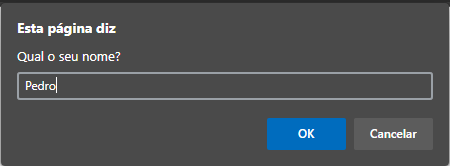
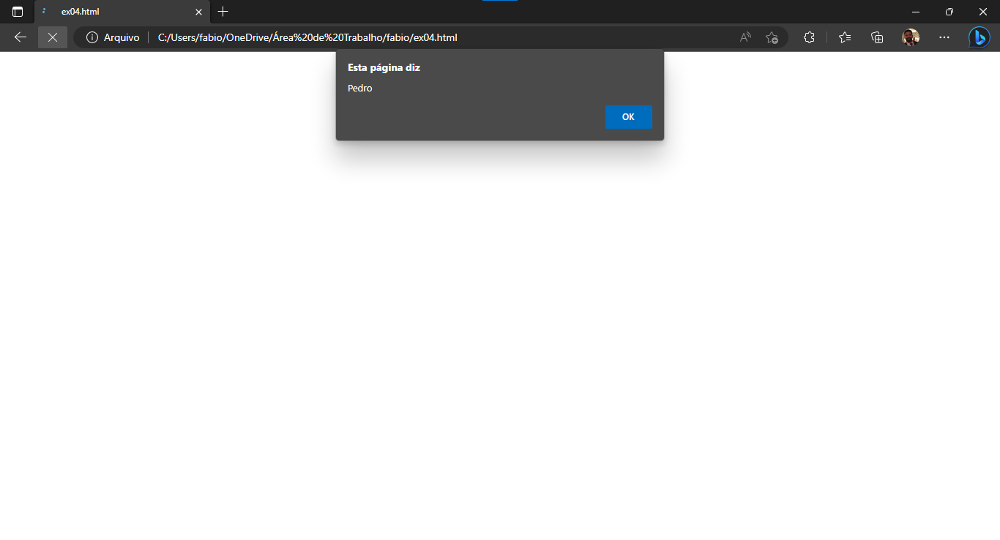

# <u>**VARIÁVEIS E OPERADORES**</u>

## **ENTRADA DE DADOS**

Para que possa haver interação do usuário com a aplicação que está sendo desenvolvida, é necessário que alguns dados fornecidos pelos usuários sejam armazenados pela aplicação.

Para armazenar os dados, utilizamos as **variáveis** e **constantes**. Elas são espaços alocados na memória do computador que permitem que os dados sejam mantidos durante a execução da aplicação. Cada variável e constante criada deverá ter um nome, que será definido pelo próprio desenvolvedor. É ***extremamente recomendável*** que o nome da variável ou constante esteja de acordo com a sua utilidade. Por exemplo, se você pedir para o usuário informar a idade, o nome da variável ou constante poderá ser _idade_, _idadeUsuario_, _age_, ou algum outro nome que seja fácil de relacionar com o dado que será armazenado.

Um exemplo prático é quando um cliente chega no caixa eletrônico do banco e, após autenticar-se, informa que deseja **sacar uma quantia** de dinheiro. Esta quantia será armazenada pela aplicação que está sendo executada no caixa eletrônico, pois servirá para permitir ou não o saque, consoante a quantia que o cliente possui depositado no banco. Após permitir ou não a realização do saque, a quantia informada no início do programa não ficará mais armazenada na aplicação do caixa eletrônico.

Algumas restrições em JavaScript, tanto para variáveis como para as constantes, são as seguintes:
- Não podem conter espaços no seu nome
- Não podem começar com número
- Não podem conter caracteres especiais (+, -, *, /, %, #)
- Não podem utilizar nomes reservados (function, document, alert, return, for)

Merece destaque também algumas situações:
- <u>_Case sensitive_</u>: O JavaScript é sensitivo ao maiúsculo e minúsculo. Isso significa que nomes como _idadeUsuario_ e _idadeusuario_ são diferentes. A letra **U** maiúsculo e minúsculo faz com que sejam criados dois espaços diferentes na memória.
- <u>_Camelcase_</u>: Quando houver constante ou variável com nome composto (idadeUsuario, por exemplo), uma boa prática é usar a primeira letra minúscula e as próximas palavras começarem com letra maiúscula.

> Alguns nomes de constantes e variáveis que podemos usar, são: cidade, nomeCidade, nomeCliente, email, telefone, salarioAtual, salarioNovo, preco, somaPreco, precoFinal.

Para declarar constantes ou variáveis em JavaScript, podemos usar, respectivamente, **_const_** ou **_let_**.

_O uso do **var** deixou de ser recomendado em versões atuais do JavaScript, pois ao final do bloco de código a **let** e a **const** deixam de existir e, além disso, impedem que um programa rode com problemas no código (duas variáveis com o mesmo nome, por exemplo)._

Veja abaixo a diferença entre elas.

### <u>**Constantes</u>**
Uma _const_, como o próprio nome diz, é **constante**, ou seja, o dado atribuído para uma constante nunca poderá ser alterado no decorrer do programa.

Um exemplo de código usando _const_:
```javascript
<script>
    const diasDaSemana = 7;
</script>
```
> No código acima, foi criado, na memória do computador, um espaço para alocar este dado. Após a execução do programa este dado será apagado da memória do computador e não estará mais acessível.

### <u>**Variáveis</u>**
Uma variável (_let_) é uma caixinha criada na memória do computador, que é passível de alterações, obedecendo o dado que o desenvolvedor atribuir para a _let_ durante a execução do programa.

Umm exemplo de código que use a _let_:
```javascript
<script>
    let salarioMinimo = 0;
    salarioMinimo = 1212;
    let reajusteSalarioMinimo = salarioMinimo * 0.743;
    salarioMinimo = salarioMinimo + reajusteSalarioMinimo;
</script>
```

_O código acima, que não está nada otimizado, foi desenvolvido apenas para demonstrar que <u>o valor da _let_ ***salarioMinimo*** pôde ser alterado durante a execução do programa.</u>_

Agora que sabemos que existem as _constantes_ **(const)** e _variáveis_ **(let)**, vamos criá-las e atribuir valor para elas. Na verdade, quem atribuirá valor para elas será o usuário do programa que você desenvolverá. Isso será possível usando o **prompt()**.

### <u>**prompt()</u>**

Como já sabemos apresentar dados para o usuário, agora vamos <u>receber</u> dados fornecidos pelo usuário. O comando/método prompt() faz com que seja exibido uma caixa com um texto e um espaço para digitação.

Para brincar com o prompt(), crie um novo arquivo, chamado ***<u>ex04.html</u>***. O código que deverá conter neste arquivo é:
```javascript
<script>
    const nome = prompt("Qual o seu nome?");
    alert(nome);
</script>
```

> No código acima, ao criarmos a _const_ nome já será atribuído valor para essa "_caixinha_". O valor será o que o usuário digitar na caixa que foi apresentada, conforme demonstrado na figura abaixo. Na figura eu já havia digitado o nome "Pedro", apenas para exemplo.



> Na linha após a criação da _const_, foi colocado um _alert_, para apresentar na tela o valor que foi armazenado na _const_ recém criada. O resultado será o mesmo da figura abaixo, conforme já exemplificado anteriormente.



Um programa também pode solicitar que o usuário informe diversos dados, por exemplo, imaginando um formulário de cadastro. Num formulário serão necessários o nome, endereço, CPF, telefone, e-mail, dentre outros.

Vamos imaginar um programa que peça para que o usuário informe apenas três dados: nome, sobrenome e idade. Ao final, o programa deverá apresentar o nome do usuário completo e quantos anos possui.

Crie o arquivo ***<u>ex05.html</u>***. O código necessário que o arquivo deverá conter será o seguinte:

```javascript
<script>
    const nome = prompt("Informe o seu nome:");
    const sobrenome = prompt("Informe o seu sobrenome:");
    const idade = prompt("Informe a sua idade:");
    const nomeCompleto = nome + " " + sobrenome;
    document.write("O seu nome completo é " + nomeCompleto + " e você possui " + idade + " anos.");
</script>
```

> No código acima foram criadas três constantes e a elas, usando o método *prompt()*, foram atribuídos os seus respectivos valores. **Observe que as constantes possuem nomes de acordo com a sua utilidade.**
> Após a atribuição de valor para as constantes, foi criada uma nova _const_, nomeCompleto, que recebeu a ***concatenação*** dos valores contidos nas constantes **nome** e **sobrenome**.
> Usando o método document.write(), escrevemos na tela uma mensagem com diversas concatenações.

Até então trabalhamos apenas com _const_, porém vamos fazer um exemplo com _let_, para mostrar de que forma o programa poderá manipular um dado.

Considere que um programa solicitará ao usuário que ele informe o ano atual e o ano de nascimento. Ao final, o programa informará qual é a idade do usuário.

Para tal, crie o arquivo ***<u>ex06.html</u>***. Neste arquivo, insira o seguinte código:
```javascript
<script>
    const anoAtual = prompt("Informe o ano atual:");
    const anoNascimento = prompt("Informe o ano do seu nascimento:");
    const idade = anoAtual - anoNascimento;
    document.write("Neste ano você completará ou já completou " + idade + " anos.");
</script>
```

> No código acima foram criadas duas constantes, sendo uma para o ano atual e a outra para o ano de nascimento do usuário. Ambas informações serão fornecidas pelo usuário. A próxima linha fará um cálculo matemático (subtração) para ver a diferença entre os dois valores, obtendo a idade do usuário. No último comando utilizamos o método document.write() para escrever na tela o resultado da operação matemática, concatenando-o com um outro texto, para deixar a mensagem mais amigável.

No JavaScript, é possível que sejam realizadas todas as operações matemáticas. Os sinais que correspondem com cada operação, são:
- <u>Adição</u>: **+** _(numero1 + numero2)_
- <u>Subtração</u>: **-** _(numero1 - numero2)_
- <u>Multiplicação</u>: <b>*</b> _(numero1 * numero2)_
- <u>Divisão</u>: **/** _(numero1 / numero2)_
- <u>Módulo</u>: **%** _(numero1 % numero2)_

#

**Vamos falar sobre concatenações?**

A concatenação é um recurso que utilizamos para unir valores, sejam eles resultantes de operações realizadas pelo programa ou simplesmente texto que definimos para deixar as mensagens mais amigáveis.

Nos exemplos acima, note que alguns textos foram determinados pelo desenvolvedor do programa
- _Neste ano você completará..._
- _O seu nome completo é..._
- _...e você possui X anos..._

Este recurso é super importante e poderá ser feito de diversas formas. A forma que utilizamos acima contemplou o uso de aspas duplas (" "). Poderíamos, ao invés de utilizarmos aspas duplas, simplesmente substituí-las pelo uso de aspas simples (' '). A concatenção usando as aspas funciona da seguinte forma:
- texto desejado entre aspas
- após as aspas, coloque o sinal de adição (+) para indicar que você concatenará aquele texto com algum outro valor

**<u>Exemplos de concatenação:</u>**
> const mensagem = "O nome é " + nome; 
> - *Resultado: O nome é Fábio*

> const endereco = nomeRua + ", " + numeroImovel + ".";
> - *Resultado: Rua Santa Catarina, 3800.*

> const cidade = nomeCidade + "(" + siglaEstado + ")";
> - *Resultado: Araquari(SC)*

> const mensagem = "Bom dia, " + nome + ".";
> - *Resultado: Bom dia, Fábio.

**<u>DICA</u>: Porém, a forma mais moderna de concatenar valores é usando as _Template Strings_.**

Com o uso das _Template Strings_ torna mais fácil a concatenação de valores. Nessa forma, as aspas são substituídas pela crase, e a mensagem é mais fluída. Observe, os mesmos quatro exemplos descritos acima, porém usando _Template Strings_:
> const mensagem = `O nome é ${nome}`;

> const endereco = `${nomeRua}, ${numeroImovel}.`;

> const cidade = `${nomeCidade}(${siglaEstado})`;

> const mensagem = `Bom dia, ${nome}.`;

*<u>*Não repeti os resultados, pois eles seriam exatamente os mesmos.*</u>

O uso das _Template Strings_ demanda apenas que a crase seja aberta para indicar o início da mensagem. Antes de inserir a próxima crase, indicando o fim do texto, cada _const_ ou _let_ que for mencionada no texto deverá ser precedida pelo cifrão, estando dentro de chaves/chavetas **{ }**.

#

Agora que já sabemos como interagir com o usuário, vamos treinar um pouco?

Clique no link abaixo para acessar uma lista de exercícios super simples, que te possibilitarão treinar os recursos abordados até agora.

### [<u>**Lista de Exercícios: Treinando Entrada e Saída de Dados**</u>](./02_03_01_listaExercicios/README.md)

## Ou, caso queira continuar aprendendo...

### [<u>**Próxima Etapa: Comentários!**</u>](./../02_04_comentarios/README.md)